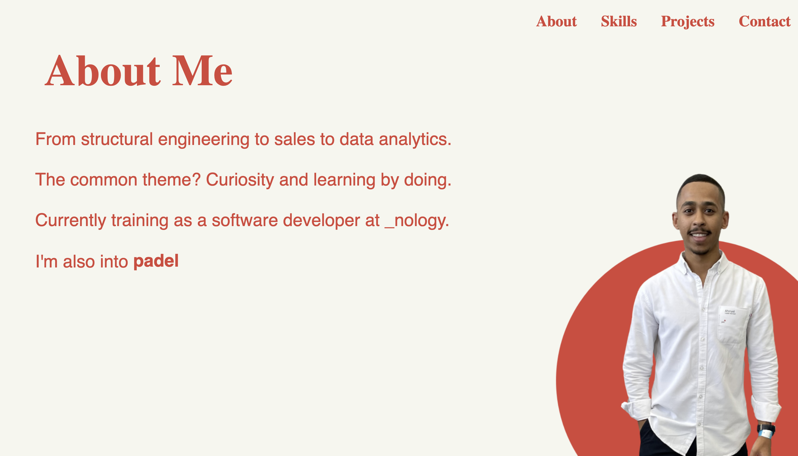

# Personal Portfolio

Welcome to my portfolio repository.

This website showcases who I am, the projects I've developed, and the technologies I've been learning throughout my software development journey at _nology. It is an ongoing project where I continue to improve my frontend skills, explore new ideas, and refine my design.

## Website Screenshot

## Purpose

* Showcase my projects and technical skills
* Demonstrate my knowledge of HTML, SCSS, and Git
* Design and create a clean, responsive, and modern portfolio website

## Tech Stack

* HTML5
* SCSS / CSS3
* Git & GitHub
